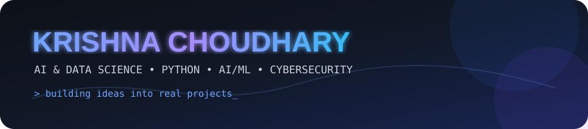
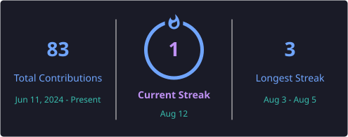
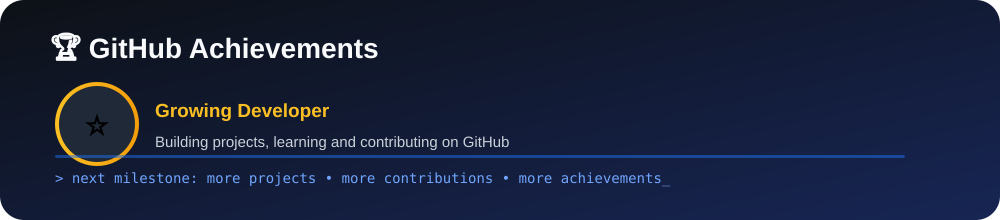

<div align="center">



<a href="https://github.com/krishna-choudhary2607">
  
</a>

<p>
  <a href="https://github.com/krishna-choudhary2607"></a>
  <a href="https://github.com/krishna-choudhary2607?tab=followers"></a>
</p>

</div>

---

## 🧑‍💻 About Me

I'm **Krishna Choudhary**, a BCA student specializing in **Artificial Intelligence & Data Science** who enjoys learning by building.

- 🐍 My main language is **Python**
- 🤖 Interested in **AI, Machine Learning & Data Science**
- 🔐 Exploring **Cybersecurity, Ethical Hacking & Networking**
- 🌐 Building **web and backend projects**
- 📱 Exploring **Flutter & Dart**
- 🧠 Strengthening my fundamentals in **Python, Linux, Git, Networking and AI/ML**
- 🚀 Long-term goal: combine **AI + Data Science + Cybersecurity** to build useful real-world products

> 💡 **Learn → Build → Break → Fix → Repeat.**

---

## 🛠️ Tech Stack

<div align="center">

### Languages & Development


### AI / Data Science

<br/>


### Tools & Platforms


</div>

---

## 🚀 Featured Projects

<div align="center">
<a href="https://github.com/krishna-choudhary2607/First-Website"></a>
<a href="https://github.com/krishna-choudhary2607/cafe-havana-site"></a>
</div>

### 🌐 First-Website
My first web development project, focused on learning the fundamentals of building and structuring a website.

### ☕ Cafe Havana Site
A modern website project built with **React + Vite**, exploring component-based frontend development and modern web tooling.

---

## 📊 GitHub Analytics
<div align="center"> </div>

## 🔥 GitHub Streak
<div align="center"></div>

## 🏆 Achievements
<div align="center"></div>

> **Note:** GitHub's official Achievements are separate from the README and are controlled by GitHub itself. citeturn0search0turn0search5

---

## 📈 Contribution Activity
<div align="center"></div>

## 🐍 Contribution Snake
<div align="center">
<picture>
  <source media="(prefers-color-scheme: dark)" srcset="./profile/github-contribution-snake-dark.svg" />
  <source media="(prefers-color-scheme: light)" srcset="./profile/github-contribution-snake.svg" />
  
</picture>
</div>

---

## 🎯 Current Focus
| Area | Status |
|---|---|
| 🐍 Python | 🟢 Building |
| 🤖 AI / ML | 🟡 Learning |
| 📊 Data Science | 🟡 Learning |
| 🌐 Web Development | 🟢 Building |
| 🔐 Cybersecurity | 🟡 Exploring |
| 🌐 Networking | 🟡 Learning |
| 🐧 Linux | 🟡 Learning |
| 📱 Flutter / Dart | 🟡 Exploring |

## 🧠 2026 Learning Roadmap
```text
Python ────────────────████████████████░░── Advanced
AI / Machine Learning ─████████████░░░░░░── Learning
Data Science ──────────███████████░░░░░░░── Learning
Networking ────────────█████████░░░░░░░░░── Learning
Linux ─────────────────████████░░░░░░░░░░── Learning
Cybersecurity ─────────███████░░░░░░░░░░░── Exploring
Backend Development ───███████░░░░░░░░░░░── Building
Flutter / Dart ────────██████░░░░░░░░░░░░── Exploring
```

---

## 🤝 Connect With Me
<div align="center">
<a href="https://github.com/krishna-choudhary2607"></a>
<a href="https://www.linkedin.com/"></a>
</div>

---

<div align="center">
### 💭 Developer Mindset
**"Don't just learn the technology. Build something with it."**

⭐ If you like my work, consider starring a repository!


</div>
